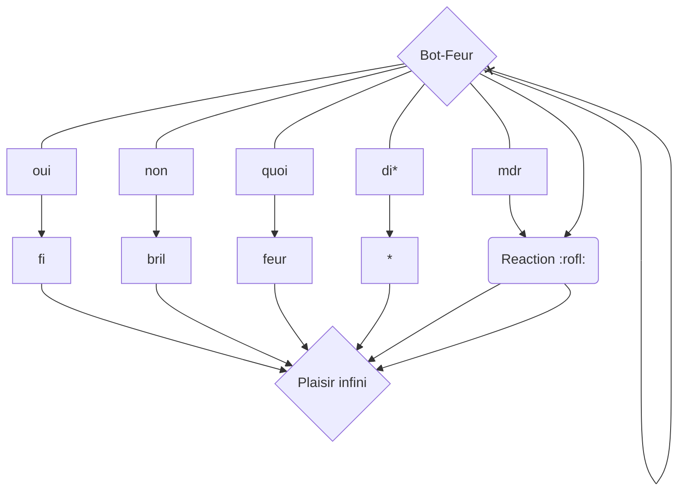

# Bot-Feur
[Add to discord](https://discord.com/api/oauth2/authorize?client_id=958447495913013258&permissions=137439370304&scope=bot%20applications.commands)

[DockerHub](https://hub.docker.com/repository/docker/efreipaul/bot-feur/general)

## Usage

Il faut specifier la variable d'environement **TOKEN** avec le token de votre bot.

### Graph

## FAQ

> Q: Il fait quoi ce bot ?
 
> R: Il fait feur

## Acknowledgments

I would like greatfully to thank:

- [Discord.py Documentations](discordpy.readthedocs.io) for the docs
- [Choose an open source license](https://choosealicense.com/) for the license
- [Shield.id](https://shields.io/) for the bages
